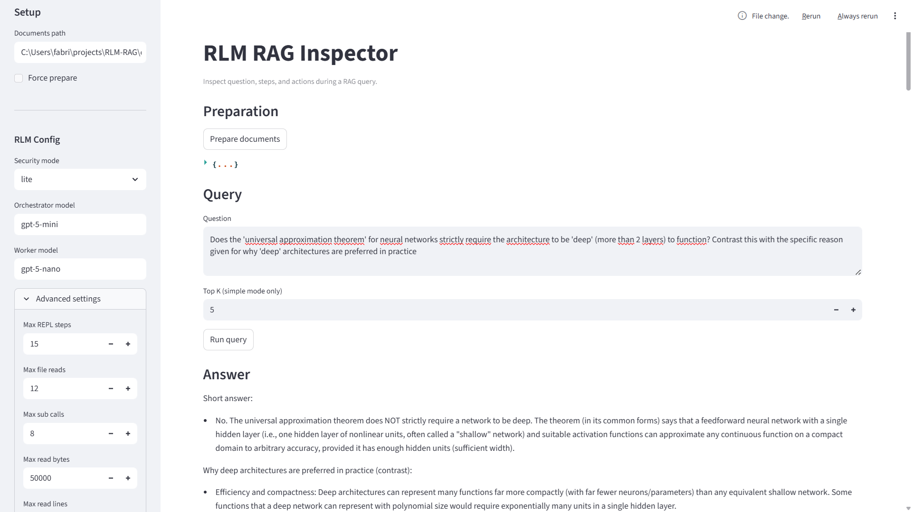
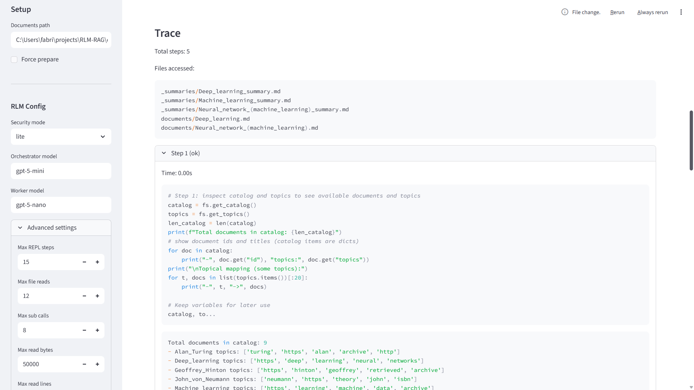

# RLM-RAG

Recursive Language Model (RLM) Filesystem RAG plus a baseline vector RAG template.
Built for experiments, integration with the RAG Evaluator platform, and real-world
RAG flows that need observability, safety options, and repeatability.


Python package name: `custom_rag` (kept for evaluator compatibility).

## Highlights

- RLMFilesystemRAG: an agent that writes Python to explore a prepared corpus
- Two-tier LLM architecture (orchestrator + worker) with retry, cache, and circuit breaker
- Security modes: "lite" (fast in-process) and "full" (subprocess isolation)
- Manifest-based preparation with summaries, topics, and section indexes
- Streamlit inspector UI for traces, sources, and token usage
- Baseline CustomRAG (vector) implementation for quick baselines and evaluator integration

## Contents

- Quick start
- Architecture and data flow
- RLMFilesystemRAG usage
- Configuration reference
- Document preparation
- Security modes
- UI inspector
- Baseline vector RAG
- Core interfaces (BaseRAG and provider types)
- RAG Evaluator integration
- Project structure, testing, troubleshooting

## Architecture and Data Flow

RLM-RAG turns a document corpus into a prepared filesystem and lets an LLM
write Python to explore it through a restricted REPL. For small corpora it
falls back to a simple context-based RAG.

### High-level flow

1. `prepare_documents()` builds a prepared filesystem (summaries, topics, index).
2. The system routes to:
   - SimpleContextRAG for small corpora.
   - RLMAgent for larger corpora.
3. The orchestrator LLM writes Python, executed in a REPL with `fs.*` tools.
4. The worker LLM is used for sub-tasks (summaries, extraction).
5. Results include sources, confidence, trace, and token usage.

## Quick Start

### 1) Install

```bash
uv sync --extra dev --extra docs --extra ui
```

Or with pip:

```bash
pip install -e ".[dev,docs,ui]"
```

### 2) Configure environment

```bash
cp .env.example .env
# Add OPENAI_API_KEY (OpenAI) or
# AZURE_OPENAI_ENDPOINT + AZURE_OPENAI_API_KEY (Azure OpenAI) to .env
```

### 3) Run the RLM manual test

```bash
uv run python examples/rlm_manual_test.py
```

### 4) Run the Streamlit inspector UI

```bash
uv run streamlit run examples/streamlit_app.py
```

### 5) Run the baseline vector RAG example

```bash
uv run python examples/basic_usage.py
```

### 6) Run tests

```bash
uv run pytest
```

## RLMFilesystemRAG Usage

```python
from custom_rag.rlm import RLMFilesystemRAG, RLMConfig

config = RLMConfig(
    security_mode="lite",
    orchestrator_model="gpt-5-mini",
    worker_model="gpt-5-nano",
)

rag = RLMFilesystemRAG(rlm_config=config)
rag.prepare_documents("data/manual_test")

result = rag.query("What are the main concepts?")
print(result["answer"])
print(result["metadata"]["sources"])
rag.close()
```

### Return format (RLMFilesystemRAG.query)

```python
{
    "answer": str,
    "context": list[str],
    "metadata": {
        "retrieval_time": float,
        "generation_time": float,
        "sources": list[str],
        "confidence": str,  # HIGH | MEDIUM | LOW
        "token_usage": dict,
        "trace": dict,
        "mode": "rlm_agent" | "simple_context",
        "security_mode": "lite" | "full",
    },
}
```

### Streaming (experimental)

`RLMFilesystemRAG.query_stream()` is implemented for SimpleContextRAG and returns
stream events for that mode. The RLMAgent streaming hook is not implemented yet,
so use `query()` for agent mode for now.

## Configuration Reference (RLMConfig)

All defaults below reflect `custom_rag.rlm.RLMConfig`.

| Field | Default | Purpose |
| --- | --- | --- |
| security_mode | "lite" | Execution isolation: "lite" or "full" |
| orchestrator_model | "gpt-5-mini" | Main reasoning model |
| worker_model | "gpt-5-nano" | Sub-task model (summaries, extraction) |
| max_repl_steps | 15 | Max REPL steps per query |
| repl_timeout | 5.0 | Seconds per REPL step |
| max_file_reads | 12 | Max filesystem reads per query |
| max_read_bytes | 50000 | Max bytes returned per read |
| max_read_lines | 1000 | Max lines returned per read |
| max_sub_calls | 8 | Max sub-LLM calls per query |
| max_recursion_depth | 2 | Max depth for sub-LLM calls |
| max_tokens | 80000 | Token budget for sub-calls |
| circuit_failure_threshold | 3 | Failures before circuit opens |
| circuit_timeout | 60.0 | Seconds before circuit half-open |
| max_retries | 3 | Retry attempts for transient errors |
| retry_base_delay | 1.0 | Base delay for exponential backoff |
| enable_cache | true | Cache LLM responses |
| cache_max_entries | 100 | LRU cache size |
| cache_ttl_seconds | 300.0 | Cache TTL in seconds |
| small_corpus_threshold | 10 | Switch to SimpleContextRAG at or below |
| chunk_size | 1000 | Chunk size during preparation |
| chunk_overlap | 200 | Overlap between chunks |
| use_llm_summaries | true | Generate LLM summaries during prep |
| use_llm_topics | true | Extract LLM topics during prep |
| max_topics_per_doc | 5 | Topics per document |
| min_sources_for_high_confidence | 2 | Sources required for HIGH |
| log_level | "INFO" | Logging verbosity |

## Document Preparation

Preparation creates a parallel directory next to your input with the suffix
`_prepared`. It includes summaries, topics, and indexes for fast navigation.

### Prepared filesystem layout

```
{input}_prepared/
|-- _meta/
|   |-- catalog.json
|   `-- section_index.json
|-- _index/
|   `-- topics/
|       `-- _topic_map.json
|-- _summaries/
|   `-- {doc_id}_summary.md
|-- documents/
|   `-- {doc_id}.md
`-- manifest.json
```

### Supported input formats

- .txt
- .md
- .pdf (requires `pypdf`)
- .docx (requires `python-docx`)

### Manifest caching

`manifest.json` stores document hashes and relevant configuration. If nothing
changed, preparation is skipped unless `force=True` is passed.

## Security Modes

RLMFilesystemRAG supports two execution modes:

- "lite": in-process REPL, fastest for trusted content.
- "full": subprocess REPL with hard timeout for untrusted content.

Security helpers such as `InjectionGuard` and `SecureFilesystemTools` are
available in `custom_rag.rlm.security` for prompt-injection defense. Wire them
in if you need document wrapping beyond the default tools.

## UI Inspector

The Streamlit app in `examples/streamlit_app.py` lets you:

- prepare documents,
- run queries,
- inspect trace steps,
- inspect token usage and sources,
- download the trace JSON.




## Baseline Vector RAG (CustomRAG)

The `CustomRAG` class is a simple vector RAG using OpenAI embeddings and
in-memory cosine similarity. It is useful as a baseline or a template.

```python
from custom_rag import CustomRAG

rag = CustomRAG(
    chunk_size=1000,
    chunk_overlap=200,
    embedding_model="text-embedding-3-small",
    llm_model="gpt-4o-mini",
)
rag.prepare_documents("data/raw")
result = rag.query("What is RAG?")
print(result["answer"])
```

## Core Interfaces (BaseRAG and Provider Types)

The `custom_rag.base_rag.BaseRAG` interface mirrors the RAG Evaluator contract.
If you are integrating with the evaluator, start here.

### Required methods

| Method | Description |
| --- | --- |
| `prepare_documents(path)` | Index documents from a directory |
| `query(question, top_k)` | Full RAG pipeline (retrieve + generate) |
| `get_metrics()` | Return implementation metrics |

### Optional methods

| Method | Description |
| --- | --- |
| `retrieve(question, top_k)` | Retrieval only (returns `RetrievedContext`) |
| `generate(question, context)` | Generation only (returns `GeneratedAnswer`) |
| `close()` | Clean up resources |

### `query()` return format

```python
{
    "answer": str,
    "context": list[str],
    "metadata": {
        "retrieval_time": float,
        "token_usage": dict,  # optional
        "sources": list[str],  # optional
    },
}
```

### Provider data types

Defined in `custom_rag.provider_interfaces`:

- `RetrievedChunk`: one retrieved chunk with score and source
- `RetrievedContext`: chunks + trace + timing
- `RetrievalTrace`: standardized retrieval steps and metadata
- `GeneratedAnswer`: generated text + token usage + timing

Token accounting is handled by `custom_rag.token_tracker.TokenUsage`.

## RAG Evaluator Integration

This repo mirrors the interfaces used by the RAG Evaluator platform. To
integrate your implementation:

1. Copy your RAG implementation file:
   `src/custom_rag/rag.py` ->
   `RAG-evaluator/src/rag_evaluator/rag_implementations/my_custom_rag/my_rag.py`
2. Update imports:
   - From `custom_rag.base_rag` to `rag_evaluator.common.base_rag`
3. Register your implementation in the evaluator CLI.

See:
<https://github.com/fabrizioamort/RAG-evaluator/blob/main/docs/custom_rag_integration.md>

## Environment Variables

Required:

- `OPENAI_API_KEY`: OpenAI API key used by RLMFilesystemRAG and CustomRAG.

Optional (not read automatically by the code, but useful for scripts):

- `OPENAI_MODEL`
- `OPENAI_EMBEDDING_MODEL`
- `OPENAI_BASE_URL`
- `DATA_DIR`
- `INDEX_DIR`

## Project Structure

```
RLM-RAG/
|-- examples/
|   |-- basic_usage.py
|   |-- rlm_manual_test.py
|   `-- streamlit_app.py
|-- src/
|   `-- custom_rag/
|       |-- rlm/
|       |   |-- agent.py
|       |   |-- llm_client.py
|       |   |-- preparation.py
|       |   |-- prompts.py
|       |   |-- rlm_rag.py
|       |   `-- security.py
|       |-- base_rag.py
|       |-- provider_interfaces.py
|       |-- rag.py
|       |-- token_tracker.py
|       `-- __init__.py
|-- tests/
|-- data/
|-- pyproject.toml
`-- README.md
```

## Testing

```bash
uv run pytest
```

## Troubleshooting

- Missing `OPENAI_API_KEY`: add it to `.env` or your shell environment.
- PDF/DOCX support: install extras `.[docs]` or `uv sync --extra docs`.
- Slow queries: reduce `max_repl_steps`, `max_file_reads`, or switch to "lite".
- Small corpora: lower `small_corpus_threshold` to force RLMAgent mode.

## License

MIT License. See `LICENSE` if provided.
