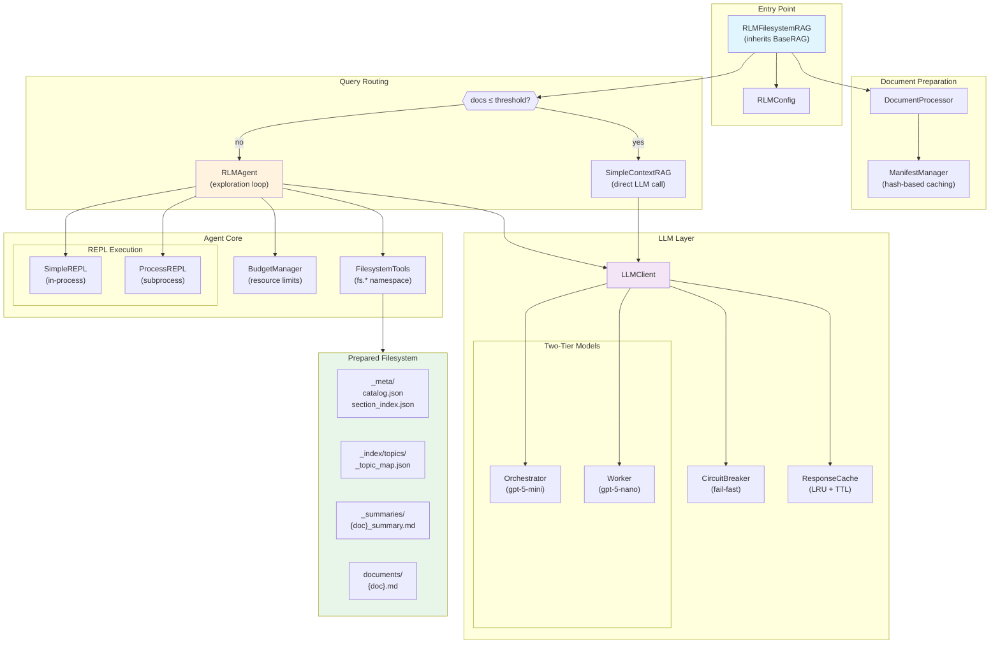

# RLM-RAG Architecture

This document describes the architecture of RLM-RAG, a Recursive Language Model approach to Retrieval-Augmented Generation.

## Overview

RLM-RAG transforms a document corpus into an explorable filesystem that an LLM agent navigates by writing and executing Python code. This approach enables dynamic, multi-step reasoning over large document sets.

## System Architecture



## Component Responsibilities

### Entry Point

| Component | Responsibility |
|-----------|----------------|
| `RLMFilesystemRAG` | Main API, routing logic, BaseRAG interface compliance |
| `RLMConfig` | Configuration with validation, security mode toggle |

### Document Preparation

| Component | Responsibility |
|-----------|----------------|
| `DocumentProcessor` | Load documents, generate summaries, extract topics, build indexes |
| `ManifestManager` | Track document hashes, skip unchanged files on re-preparation |

### Query Routing

The system routes queries based on corpus size:

- **Small corpus** (≤ `small_corpus_threshold`): Uses `SimpleContextRAG` for a single LLM call
- **Large corpus**: Uses `RLMAgent` for multi-step exploration

### Agent Core

| Component | Responsibility |
|-----------|----------------|
| `RLMAgent` | Main exploration loop: prompt → code → execute → observe → repeat |
| `BudgetManager` | Enforce limits on REPL steps, file reads, sub-LLM calls |
| `FilesystemTools` | Read-only access to prepared filesystem via `fs.*` namespace |
| `SimpleREPL` | In-process code execution (security_mode="lite") |
| `ProcessREPL` | Subprocess execution with hard timeout (security_mode="full") |

### LLM Layer

| Component | Responsibility |
|-----------|----------------|
| `LLMClient` | Unified API for orchestrator and worker models |
| `CircuitBreaker` | Prevent cascading failures when API is unavailable |
| `ResponseCache` | LRU cache with TTL to reduce redundant API calls |

## Security Modes

| Mode | REPL | Isolation | Injection Defense | Use Case |
|------|------|-----------|-------------------|----------|
| `lite` | SimpleREPL | None | None | Trusted documents, development |
| `full` | ProcessREPL | Subprocess | InjectionGuard wrapping | User uploads, production |

## Data Flow

### Preparation Flow

```
Source Documents → DocumentProcessor → Prepared Filesystem
                         ↓
                   ManifestManager → manifest.json (cache key)
```

### Query Flow

```
Question → RLMFilesystemRAG
              ↓
         Route by corpus size
              ↓
    ┌─────────┴─────────┐
    ↓                   ↓
SimpleContextRAG    RLMAgent
    ↓                   ↓
Single LLM call    Exploration Loop:
    ↓               1. Prompt orchestrator
    ↓               2. Extract code blocks
    ↓               3. Execute in REPL
    ↓               4. Observe results
    ↓               5. Repeat until final_answer
    ↓                   ↓
    └─────────┬─────────┘
              ↓
         Response with:
         - answer
         - sources
         - confidence
         - trace
```

## Prepared Filesystem Structure

```
{input}_prepared/
├── _meta/
│   ├── catalog.json          # Document metadata list
│   └── section_index.json    # Section boundaries per document
├── _index/
│   └── topics/
│       └── _topic_map.json   # Topic → [doc_ids] mapping
├── _summaries/
│   └── {doc_id}_summary.md   # LLM-generated summaries
├── documents/
│   └── {doc_id}.md           # Processed documents
└── manifest.json             # Hash-based cache validation
```

## Integration with RAG Evaluator

`RLMFilesystemRAG` inherits from `BaseRAG`, enabling direct integration with the [RAG Evaluator](https://github.com/fabrizioamort/RAG-evaluator) platform:

```python
# In RAG Evaluator
from custom_rag.rlm import RLMFilesystemRAG

# Register as evaluation target
evaluator.add_rag(RLMFilesystemRAG(rlm_config=RLMConfig()))
```

## References

- [RLM Paper (arXiv:2512.24601v1)](https://arxiv.org/html/2512.24601v1)
- [RAG Evaluator Platform](https://github.com/fabrizioamort/RAG-evaluator)
