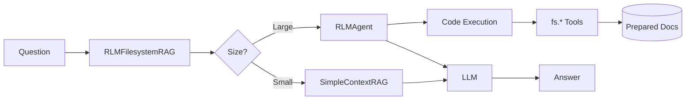

# RLM-RAG

**Recursive Language Model Filesystem RAG** - An agentic RAG system that uses code execution to explore document corpora.

## Overview

RLM-RAG implements the Recursive Language Model concept for Retrieval-Augmented Generation. Instead of simple vector similarity search, the LLM writes Python code to explore a prepared document filesystem, enabling dynamic, multi-step reasoning over large document sets.

## Key Features

- **Agentic Exploration**: LLM writes code to search, read, and analyze documents
- **Two-Tier Model Architecture**: Orchestrator (reasoning) + Worker (processing)
- **Security Modes**: In-process (`lite`) or subprocess isolation (`full`)
- **Circuit Breaker**: Automatic failover for API reliability
- **Manifest Caching**: Skip re-preparation for unchanged documents
- **RAG Evaluator Integration**: Inherits from `BaseRAG` for benchmarking

## Quick Start

```python
from custom_rag.rlm import RLMFilesystemRAG, RLMConfig

# Create RAG instance
rag = RLMFilesystemRAG(rlm_config=RLMConfig(
    security_mode="lite",
    orchestrator_model="gpt-5-mini",
))

# Prepare documents
rag.prepare_documents("./my_documents")

# Query
result = rag.query("What are the main concepts?")
print(result["answer"])
print(f"Confidence: {result['metadata']['confidence']}")
print(f"Sources: {result['metadata']['sources']}")

# Cleanup
rag.close()
```

## Installation

```bash
# Using uv (recommended)
uv sync --extra dev --extra mkdocs --extra ui

# Using pip
pip install -e ".[dev,mkdocs,ui]"
```

## Architecture

See the [Architecture Guide](architecture.md) for detailed system design.



## References

- [RLM Paper (arXiv:2512.24601v1)](https://arxiv.org/html/2512.24601v1)
- [RAG Evaluator Platform](https://github.com/fabrizioamort/RAG-evaluator)
